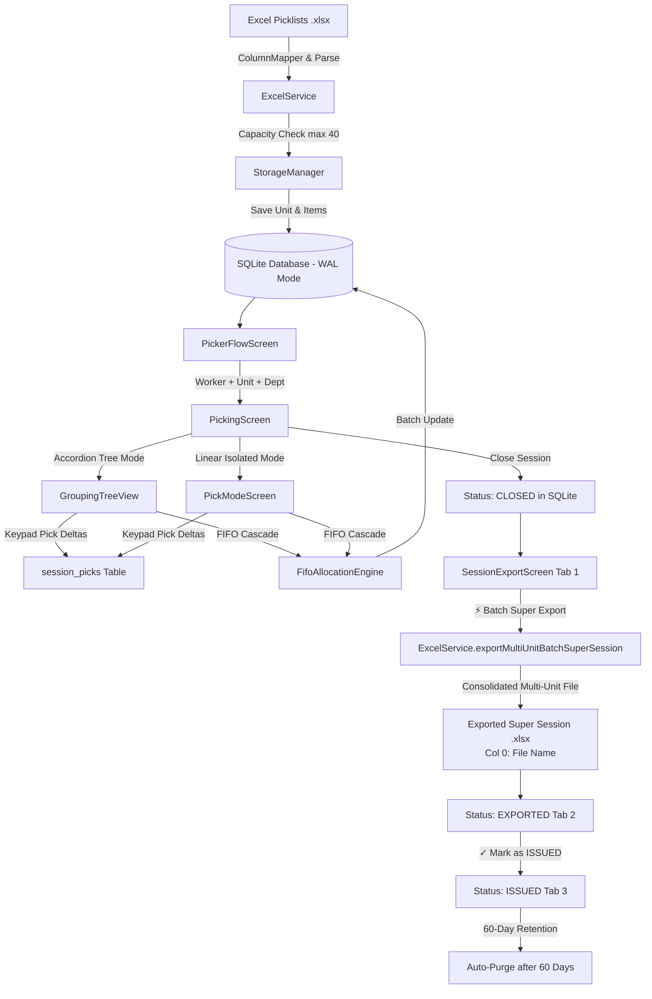

# 📦 Picklist Tracker (Android Tablet — Flutter)

[](https://flutter.dev)
[](https://dart.dev)
[](https://sqlite.org)
[](https://developer.android.com)
[](#system-architecture--data-flow)

An industrial-grade, offline-first Android tablet application engineered for manufacturing facilities and warehouse logistics. **Picklist Tracker** streamlines component picking operations directly from Excel (`.xlsx`) picklists, performs automated department-scoped FIFO (First-In, First-Out) work order allocations, provides multi-unit Super Session consolidation, accident recovery on re-import, and exports audit-ready, ERP-compliant spreadsheets.

---

## 📑 Table of Contents

- [Core Purpose & Design Philosophy](#-core-purpose--design-philosophy)
- [Key Features](#-key-features)
  - [1. 3-Step Guided Picker Onboarding Flow](#1-3-step-guided-picker-onboarding-flow)
  - [2. Dual Picking Modes: Accordion Tree & Linear Pick Mode](#2-dual-picking-modes-accordion-tree--linear-pick-mode)
  - [3. Anti-Clear Delta Console & LIFO Returns](#3-anti-clear-delta-console--lifo-returns)
  - [4. Department-Scoped FIFO Work Order Cascade](#4-department-scoped-fifo-work-order-cascade)
  - [5. Earliest Pick Date & Dynamic Urgency Glow](#5-earliest-pick-date--dynamic-urgency-glow)
  - [6. Component Resources, Pattern Rules & MAIN LINE Whole Resource Mode](#6-component-resources-pattern-rules--main-line-whole-resource-mode)
  - [7. 3-Stage Session Lifecycle & Unified Multi-Unit Super Sessions](#7-3-stage-session-lifecycle--unified-multi-unit-super-sessions)
  - [8. 40-Unit Memory Buffer, Simplified 60-Day Retention & Accidental Deletion Recovery](#8-40-unit-memory-buffer-simplified-60-day-retention--accidental-deletion-recovery)
  - [9. Admin Security, 15-Minute Timeout & Super Admin Logs](#9-admin-security-15-minute-timeout--super-admin-logs)
- [System Architecture & Data Flow](#-system-architecture--data-flow)
- [Project Directory Map](#-project-directory-map)
- [Getting Started](#-getting-started)
  - [Prerequisites](#prerequisites)
  - [Installation & Setup](#installation--setup)
  - [Running Unit & Integration Tests](#running-unit--integration-tests)
  - [Building Release APK](#building-release-apk)
- [Database Schema Highlights](#-database-schema-highlights)
- [Legal Disclaimer & Liability Waiver](#-legal-disclaimer--liability-waiver)

---

## 🎯 Core Purpose & Design Philosophy

Manufacturing picking operations often suffer from paper clutter, transcription errors, inventory latency, and stock discrepancies. Picklist Tracker was engineered from the ground up for warehouse floor reliability:

- **100% Offline Resilience**: Zero dependence on remote servers, APIs, or uninterrupted Wi-Fi. All state transitions, picks, returns, and session history commit instantly to an on-device SQLite database operating in Write-Ahead Logging (`WAL`) mode.
- **Strict Scope Isolation**: Prevents human errors during picking. Work orders and parts are strictly contained within their active department, resource ID, or line boundary.
- **Anti-Clear Data Integrity**: Numeric keypads input additive deltas. Once saved to the database, quantities cannot be cleared or zeroed out accidentally by typing.
- **Ergonomic Tablet UI**: Designed specifically for portrait tablet usage with high-contrast, industrial warehouse aesthetics (OLED dark theme), large touch targets, and clear visual indicators.

---

## 🚀 Key Features

### 1. 3-Step Guided Picker Onboarding Flow
Workers start each picking shift via an intuitive 3-step setup:
1. **Worker Selection**: Pickers tap their profile chip from an Admin-approved standard pickers roster. Manual text entry is locked out to eliminate duplicate or misspelled worker accounts.
2. **Unit Selection**: Choose an existing manufacturing unit from local memory (with live progress indicators and urgency dates) or import a new `.xlsx` picklist via file picker.
3. **Department Selection**: Select the designated destination department. Incomplete departments with the earliest due date are highlighted with an urgency glow to ensure timely part delivery.

### 2. Dual Picking Modes: Accordion Tree & Linear Pick Mode
- **Accordion Tree Mode (`GroupingTreeView`)**:
  - Full structural view displaying the complete assembly hierarchy:
    ```
    Unit (File) ➔ SubUnit ➔ Type (MAIN LINE / SUBASSEMBLY) ➔ Department ➔ Resource ID ➔ Line ➔ Part ID
    ```
  - Displays Part-ID centric metrics (`X / Y parts (Z%)`) at group levels and individual piece counts (`qtyPicked / qtyRequired, Due: qtyDue`) on leaf rows.
  - Direct Quick-Pick triggers (`+1`, `+5`, `+10`, `Match Due`).
- **Linear Pick Mode (`PickModeScreen`)**:
  - Full-screen split view focusing on a single part at a time.
  - Upper console: Large Part ID, Description, ON_HAND bin/stock location, work order breakdown, metadata chips, and urgency badge.
  - Lower console: Touchpad numeric keypad, confirm pick, match due, return dialog, and navigation.
  - **Strict Group Isolation**: When entering Pick Mode on a Resource ID, Line, or Department, picking is strictly contained to that group. Navigation buttons (`Next`, `Prev`) and auto-advance never cross into other groups.
  - **Smooth Auto-Advance Loop**: When the end of the parts list is reached, the view smoothly loops back to the first incomplete part (`due > 0.0001 || isMissing`).

### 3. Anti-Clear Delta Console & LIFO Returns
- **Additive Delta Picking**: The keypad types the delta quantity to add to the existing pick count, preventing accidental replacement of previous progress.
- **Anti-Clear Keypad**: The `C` (Clear) button resets only the pending keypad input buffer; committed database values cannot be wiped out by typing.
- **Audited LIFO Returns**: Picking returns cannot be executed through the keypad. They require opening the dedicated "Return Picked" dialog, verifying worker identity, entering a minimum 10-character justification note, and are allocated via LIFO (Last-In, First-Out) across Work Orders. Every return is logged in the `pick_returns` audit table.
- **Missing Parts Tracking**: Flagging a part as `MISSING` records an incident in `part_flags` with a bright red status badge. If the missing part is subsequently located and fully picked, the missing flag is automatically cleared.

### 4. Department-Scoped FIFO Work Order Cascade
When picking by Part ID, parts frequently span multiple Work Orders with varying requirements:
- `FifoAllocationEngine` sorts work orders by their original Excel `rowOrder` and distributes entered quantities chronologically across WOs.
- **Department Boundary Enforcement**: Parts sharing the same Part ID in other departments are completely unaffected.

### 5. Earliest Pick Date & Dynamic Urgency Glow
Units and departments dynamically evaluate incomplete pick dates across active departments:
- 🔴 **Past Due (`< 0 days`)**: Vibrant Red Glow (`#FF3B30`).
- 🟡 **Due Soon (`0..2 days`)**: Amber Yellow Glow (`#FFB300`).
- 🟢 **Normal (`> 2 days`)**: Green Accent (`#00E676`).
- **Completed Badge**: Displayed once all parts are picked or flagged as missing (missing parts do not block completion).
- **Dynamic Recalculation**: Once the most urgent department is finished, the card automatically recalculates urgency for the next incomplete department.

### 6. Component Resources, Pattern Rules & MAIN LINE Whole Resource Mode
- **Departments vs Component Resources**:
  - **Departments (Assembly Destinations)**: Only have picking permissions (`Allow` / `Block` picking on the tablet). Auto-issue is never applied to departments.
  - **Component Resource IDs (Part Origins)**: Represent the source shop floor or supplier. Supports `Allowed for Pick` and `Auto-Issue 100%` (auto-marks 100% picked on export and hides from picking).
- **Substring Pattern Rules (Admin Tab 3)**:
  - Admins can configure pattern matching rules (e.g. if Resource ID contains `BOX`, set Allow/Block and Auto-Issue 100%).
  - Pattern rules automatically apply to all current and future matching Component Resources across units.
- **MAIN LINE Whole Resource ID Destination (Admin Tab 5)**:
  - Pick entire MAIN LINE resources across departments directly from Step 3 of the Picker Flow.
  - **Mutual Exclusion**: When active as a Whole Resource, items are strictly excluded from standard department picking to prevent double-counting.
- **Live Dual Toggles with 2-Minute Admin PIN Lock & 2-Row Sub-Banner**:
  - **Whole Resources**: Live toggle between `Combined (All Depts)` (merges all parts under `Unit ➔ Resource ID ➔ Part ID`) and `By Department` (collapsible department containers).
  - **Departments**: Live toggle between `Combined (No Line)` and `By Line`.
  - Protected with a micro lock icon requiring Admin PIN (default `1234`), providing a 2-minute unlock window.
  - **2-Row Sub-Banner**: Eliminates horizontal scroll and clipping on tablet screens:
    - **Row 1**: Scope icon, badge, title, Part ID progress badge, and Pick/Prod dates.
    - **Row 2**: `View Mode:` label + interactive live toggle.
- **One-Time Auto-Issue on Export**: Auto-issue items are written as 100% picked on the unit's first batch export only (`auto_issue_exported_{unitId}`), preventing duplicated issues on subsequent exports.

### 7. 3-Stage Session Lifecycle & Unified Multi-Unit Super Sessions
The dedicated `SessionExportScreen` manages sessions through an automated 3-stage lifecycle:
1. **Lazy Session Start (First Pick Only)**:
   - Selecting a picker name, unit, and department sets up a pending in-memory session (`sessionSeqNo = 0`).
   - The session is persisted to SQLite and consumes a sequence number **only upon the first confirmed pick** (`delta > 0`).
   - Exiting or closing a session with 0 picks discards it completely; 0-pick sessions are never saved or exported.
2. **Stage 1 (Pick & Collect — CLOSED: 80-Day Retention)**:
   - Closing a session marks it as **`CLOSED`** in SQLite.
   - Shows countdown: `⏳ X days remaining until auto-purge (80d retention)`. No premature individual exports are generated.
   - Closed sessions across all units collect in Tab 1 ("Closed") for batch consolidation.
3. **Stage 2 (Unified Batch Super Export across All Units — EXPORTED: 70-Day Retention)**:
   - Tapping `⚡ Export All Unexported (Batch Super Export)` prompts a confirmation modal.
   - Closed sessions across **ALL units** are consolidated into **ONE single Super Session** with a unique `batchId` (`BATCH_SUPER_{TabletId}_{MinSeq}_to_{MaxSeq}_{Timestamp}`) and exported into **ONE consolidated Excel file**, transitioning to **`EXPORTED`** (Tab 2).
   - Status transition resets the retention timer to **70 days**: `⏳ X days remaining until auto-purge (70d retention)`.
   - **Column 0 "File Name"**: Column 0 (Column A) is reserved for the source file name (e.g. `unit_56.xlsx`) to clearly distinguish items from different units. All original picklist columns and ERP service audit columns are shifted right by 1 index.
   - **Only Picked / Auto-Issued Rows Exported**: Untouched rows (`qtyPicked == 0` and not auto-issued) are omitted.
   - **Accurate Session-Specific Pick Metrics (`session_picks` Table)**: Each pick delta is tracked using pre-allocation snapshots. Session cards show exact unique parts picked *during that session*.
4. **Stage 3 (Mark as ISSUED — PIN-Free & Batch-Atomic — ISSUED: 60-Day Retention)**:
   - Exported sessions are grouped by `batchId` into cohesive Super Session cards.
   - Transitioning to **`ISSUED`** (Tab 3) is performed via the batch-level `✓ Mark as ISSUED` button, keeping all sessions within the batch atomic.
   - Status transition resets the countdown to **60 days**: `⏳ X days remaining until auto-purge (60d retention)`.
   - **LIFO Sorting (Newest First)**: Super Session cards on Exported and Issued tabs are always sorted latest-first.
   - **50 MB Storage Cap FIFO Auto-Purge**: If DB + logs reach 50 MB, oldest sessions (FIFO: ISSUED, then EXPORTED, then CLOSED) and oldest logs are pruned automatically.

### 8. 40-Unit Memory Buffer, Auto-Purge & Accidental Deletion Recovery
- **40-Unit Device Buffer**: Local storage maintains a maximum capacity of 40 active units. Importing unit #41 automatically auto-prunes the oldest completed unit.
- **Accidental Unit Deletion Recovery on Re-Import**:
  - If a unit was deleted and the worker re-imports the `.xlsx` picklist with the same unit name or file name, `DatabaseService.findUnitHistory` detects past sessions, workers, and picked parts.
  - A recovery modal is shown: `Recover Unit Picking History?`.
  - **`[⚡ Restore Progress & Sessions]`**: Restores picked quantities onto parsed items in FIFO order using `session_picks` deltas, clears `deleted_at`, recalculates unit status (`IN_PROGRESS` or `FULLY_PICKED`), and re-links all historical sessions.
  - **`[Start Fresh]`**: Allows clean re-importing without restoring previous progress.

### 9. Admin Security, 15-Minute Timeout & Super Admin Logs
- **15-Minute Admin Authorization Window**: Entering the Admin Panel requires the Admin PIN (default `1234`). Any subsequent admin operation is guarded by a 15-minute activity window. If 15 minutes elapse without interaction, credentials automatically expire.
- **Admin-Managed Pickers**: Standard picker accounts can only be added or removed by admins in Settings.
- **Super Admin Audit Logging (`LogService`)**:
  - Gated by a dedicated Super Admin PIN (default `7777`, configurable in Admin panel).
  - Strict **49.00 MB** circular storage cap (oldest logs auto-pruned to prevent disk overflow).
  - Searchable by log level (`ALL`, `CRASH`, `ERROR`, `WARN`, `INFO`), tag, or message with stack trace inspector.
  - **RFC 4180 CSV Export**: Formats all system logs into a compliant CSV file saved to the export directory.
  - Super Admin panel allows updating the standard Admin PIN.

---

## 🏗 System Architecture & Data Flow



---

## 📂 Project Directory Map

```
lib/
├── main.dart                          # App initialization, orientation lock & service injection
├── engine/
│   ├── column_mapper.dart             # Dynamic Excel header aliasing & normalization
│   ├── fifo_allocation_engine.dart    # Department-scoped FIFO cascade distribution
│   └── grouping_engine.dart          # Accordion tree builder & metric aggregations
├── models/
│   ├── grouping_preset.dart           # Tree hierarchy definitions & GroupLevel enum
│   ├── part_summary.dart              # Unique Part ID aggregation model
│   ├── picklist_item.dart             # Core picklist item & piece quantities
│   ├── session_metadata.dart          # Worker picking session & audit model
│   ├── unit_pick_date_urgency.dart    # Multi-format date parser & urgency glow evaluator
│   └── unit_record.dart              # Unit storage container & soft-delete properties
├── services/
│   ├── database_service.dart          # SQLite WAL operations, schema migrations & CRUD
│   ├── excel_service.dart             # Fast Excel reader, Super Session exporter & backup generator
│   ├── log_service.dart              # 49 MB circular logger & RFC 4180 CSV exporter
│   └── storage_manager.dart          # 40-unit capacity enforcement & FIFO pruning
└── ui/
    ├── screens/
    │   ├── home_screen.dart           # Application entry point, role gate & legal disclaimer
    │   ├── picker_flow_screen.dart    # 3-step picker onboarding flow (Worker ➔ Unit ➔ Dept)
    │   ├── picking_screen.dart        # Main picking dashboard & view orchestrator
    │   ├── pick_mode_screen.dart      # Full-screen isolated linear FIFO picking console
    │   ├── session_export_screen.dart # 3-stage session export hub (Closed / Exported / Issued)
    │   ├── admin_screen.dart          # PIN-gated 7-tab admin panel & device settings
    │   └── crash_recovery_screen.dart # Graceful error recovery screen with auto-retry
    ├── views/
    │   └── department_parts_view.dart # List Mode view for PickingScreen
    ├── theme/
    │   └── app_theme.dart            # Warehouse dark theme, status colors & typography
    └── widgets/
        ├── export_summary_dialog.dart # Pre-export audit check & anti-empty safeguard
        ├── grouping_tree_view.dart    # Accordion tree widget with badge indicators
        ├── tablet_header.dart         # Live shift timer, unit metadata & export triggers
        └── touch_numpad_dialog.dart   # On-screen numpad dialog for tree leaves
```

---

## 🛠 Getting Started

### Prerequisites
- **Flutter SDK**: `>= 3.24.0`
- **Dart SDK**: `>= 3.0.0 < 4.0.0`
- **Android SDK**: API Level 26+ (Android 8.0 Oreo or higher recommended)
- **Target Device**: Android tablet (e.g., Samsung Galaxy Tab, Google Pixel Tablet, or Android Tablet Emulator)

### Installation & Setup

1. **Clone the repository**:
   ```bash
   git clone https://github.com/Deltores/Warehouse-picking-tracker.git
   cd Warehouse-picking-tracker
   ```

2. **Install Flutter dependencies**:
   ```bash
   flutter pub get
   ```

3. **Verify Flutter environment**:
   ```bash
   flutter doctor
   ```

4. **Launch on connected tablet or emulator**:
   ```bash
   flutter run
   ```

---

## 🧪 Running Unit & Integration Tests

The project includes an extensive automated test suite covering FIFO allocation accuracy, column aliasing, hierarchy projection, date urgency evaluation, monotonic sequencing, Super Session multi-unit consolidation, accidental deletion recovery, and CSV formatting:

```bash
# Run all project test suites
flutter test

# Run the comprehensive standalone verification runner
flutter test test/run_tests.dart

# Run MAIN LINE whole resource, batch export & recovery tests
flutter test test/mainline_resource_and_batch_export_test.dart
```

### Key Verification Cases Passed (36/36 Tests Passing):
- ✅ **FIFO Work Order Cascade**: Accurate distribution of piece quantities across work orders.
- ✅ **Strict Department Isolation**: Verification that identical Part IDs in other departments are untouched.
- ✅ **Dynamic Column Mapper**: Robust parsing of varied Excel headers (e.g., `Part #`, `Component`, `Due Qty`).
- ✅ **Grouping Engine**: Hierarchy projection for both `MAIN LINE` and `SUBASSEMBLY` workflows.
- ✅ **Monotonic Sequencing**: Sequential session numbering (`1..9999`) with high-water mark retention.
- ✅ **Lazy Session Initialization**: Verification that sessions start only on first pick and 0-pick sessions are discarded.
- ✅ **80d / 70d / 60d Lifecycle Retention**: Countdown verification across CLOSED, EXPORTED, and ISSUED tabs.
- ✅ **Department Line Grouping Live Toggle**: Verification of hierarchy projection with and without Line level.
- ✅ **Snapshot Delta Calculation**: Verification that `previousItems` snapshot ensures 100% accurate pick delta recording.
- ✅ **Multi-Unit Super Sessions**: Batch consolidation across multiple units into a single workbook.
- ✅ **Consolidated Excel Column 0**: Reserved `File Name` in Column 0 with clean `+1` index shifting for original and ERP columns.
- ✅ **Accidental Unit Deletion Recovery**: Accurate allocation of historical pick deltas onto re-imported picklist items in FIFO order.
- ✅ **Log Export RFC 4180 Compliance**: Accurate escaping of delimiters, newlines, and quotes in CSV output.

---

## 📦 Building Release APK

To generate an optimized, signed release APK ready for sideloading or MDM deployment onto warehouse tablets:

```bash
flutter build apk --release
```

The output file will be generated at:
```
build/app/outputs/flutter-apk/app-release.apk
```

> **Note on JNI Engine Logs**: When running in `--release` mode, Flutter automatically strips verbose Android `FlutterJNI` viewport metric logs, ensuring maximum runtime efficiency and minimal battery consumption.

---

## 🗄 Database Schema Highlights

The local SQLite database (`picklist_tracker.db`) uses Write-Ahead Logging (`PRAGMA journal_mode=WAL;`) with the following primary tables:

| Table Name | Description |
|---|---|
| `units` | Stored picklist containers, file metadata, completion metrics, and `deleted_at` timestamp. |
| `picklist_items` | Individual rows containing department, line, WO, part ID, required, picked, and due quantities. |
| `sessions` | Worker shift sessions with sequential IDs, batch IDs, start/end timestamps, and export statuses. |
| `session_picks` | Fine-grained log of every pick delta made in each session (`session_id`, `unit_id`, `part_id`, `qty_picked`). |
| `pick_returns` | Complete audit trail of returned parts, worker IDs, timestamps, and required return reasons. |
| `part_flags` | Tracking for parts flagged as `MISSING` with automated resolution upon completion. |
| `admin_config` | Key-value store for Tablet ID, active export directory, pattern rules, high-water marks, and PINs. |
| `system_logs` | Circular buffer storing diagnostic logs, errors, and uncaught exceptions up to 49 MB. |

---

## ⚖️ Legal Disclaimer & Liability Waiver

```
========================================================================================
IMPORTANT LEGAL NOTICE & OPERATIONAL DISCLAIMER
========================================================================================
This software application is provided on an strictly "AS-IS" and "AS-AVAILABLE" basis 
for operational workflow assistance and picking organization only. 

The software developers, maintainers, and contributors make no representations or 
warranties of any kind, express or implied, regarding physical count accuracy, 
tolerance thresholds, or synchronization with third-party ERP systems.

The operating facility and system operators assume sole and absolute responsibility for:
1. Validating physical inventory counts against warehouse stocks.
2. Confirming that exported picklists comply with production and ERP tolerances.
3. Reviewing return logs and part flags prior to final assembly.

Under no circumstances shall the developers or contributors be held liable for any 
inventory discrepancies, physical shortages, production delays, operational downtime, 
or consequential damages arising out of the use of this application.
========================================================================================
```
